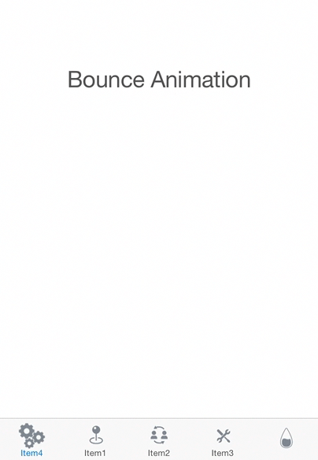

# RAMAnimatedTabBarController

UITabBarController with animated items.



## Requirements

- iOS 7.0+
- Xcode 6.1

## Installation

Just add RAMAnimatedTabBarController folder to your project.

## Usage

1. Set the class of the UITabBarController to RAMAnimatedTabBarController in your Storyboard or nib.

2. For each UITabBarItems set the class  RAMAnimatedTabBarItem in your Storyboard or nib.

3. Add custom image icon for each TabBarItems

4. Add animation for each TabBarItems : 
   * drag and drop NSObject to item UIViewController 
   * set the class of the NSObject to ANIMATION_CLASS
   * connect outlet animation in RAMAnimatedTabBarItem with ANIMATION_CLASS
   [video for step 4](http://vimeo.com/112390386)
   			
   			
## Animation Classes

* RAMBounceAnimation
* RAMLeftRotationAnimation
* RAMRightRotationAnimation
* RAMFlipLeftTransitionItemAniamtions
* RAMFlipRightTransitionItemAniamtions
* RAMFlipTopTransitionItemAniamtions
* RAMFlipBottomTransitionItemAniamtions
* RAMFrameItemAnimation

## Add custom animation
1. Create new class and inherit RAMItemAnimation class
	
	``` swift
	    class NewAnimation : RAMItemAnimation
  ```
2. Override methods: 


  ``` swift
    // method call when Tab Bar Item is selected
    override func playAnimation(icon : UIImageView, textLable : UILabel) {
      // add animation
    }
  ```  
  ``` swift
    // method call when Tab Bar Item is deselected
    override func deselectAnimation(icon : UIImageView, textLable : UILabel, defaultTextColor : UIColor) {
      // add animation
    }
  ```    
  ``` swift
    // method call when TabBarController did load
    override func selectedState(icon : UIImageView, textLable : UILabel) {
      // set selected state  
    }
  ```


##About us

[Ramotion](http://Ramotion.com) is an iPhone app design and development company. We are ready for new interesting iOS App Development projects.

Follow us on [twitter](http://twitter.com/ramotion).
